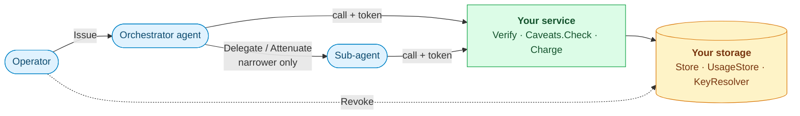

# limes

[](https://github.com/oleg-tkachuk/limes/actions/workflows/ci.yaml)
[](https://github.com/oleg-tkachuk/limes/releases/latest)
[](https://pkg.go.dev/github.com/oleg-tkachuk/limes)
[](go.mod)
[](LICENSE)

Budgeted, delegable, individually revocable capabilities for agentic workloads,
as a Go library.

A capability is a short-lived signed token that carries its own authority:
which operations, on which resources, for how much money and how many
requests, until when, and on whose behalf. An agent can hand a sub-agent a
strictly narrower copy without calling back to anyone, every charge counts
against the whole delegation chain, and any capability can be revoked
mid-flight along with everything delegated from it.

The module ships the primitive and its contracts; you supply the storage. Its
resolved dependency graph holds no database driver and no storage SDK, and
`memstore`, an in-memory implementation, is enough to start.

*Limes* was the fortified frontier of the Roman Empire — a line that marks how
far authority reaches ([Wiktionary](https://en.wiktionary.org/wiki/Limes),
[Wikipedia](https://en.wikipedia.org/wiki/Limes_(Roman_Empire))).



## Install

```bash
go get github.com/oleg-tkachuk/limes@latest
```

## Five minutes

```go
kid, pub, priv, _ := limes.GenerateEd25519Keypair()

records := memstore.New[struct{}]()          // your Store
usage   := memstore.NewUsage[struct{}](records)

signer, _ := limes.NewEd25519Signer(kid, priv)
issuer, _ := limes.NewIssuer(limes.IssuerConfig{
    Signer: signer, Store: records, IssuerName: "my-issuer",
})
verifier, _ := limes.NewStandardVerifier(limes.VerifierConfig{
    Keys:           limes.NewStaticKeyResolver(map[string]ed25519.PublicKey{kid: pub}),
    Revocations:    records,
    TrustedIssuers: []string{"my-issuer"},
})

cap, token, _ := issuer.Issue(ctx, limes.IssueRequest{
    IssuedBy: limes.Principal{Subject: "operator@example.com"}, // who asked
    Subject: limes.Principal{
        Type: limes.PrincipalAgent, TenantID: tenantID,
        Subject: "research-orchestrator",
        Agent:   &limes.AgentPrincipal{AgentType: "my-agent", RunID: runID},
    },
    Audience: []string{"my-service"},
    TTL:      15 * time.Minute,
    Caveats: limes.Caveats{
        Ops:              []limes.Op{limes.OpGet, limes.OpShare},
        ResourcePrefixes: []string{"corpus/public/"},
        MaxRequests:      500,
        MaxBudgetAmount:  limes.MustParseAmount("25.00"),
        UnitCode:         "USD",
    },
})

// On every call: verify locally, enforce the caveats, meter.
cap, err := verifier.Verify(ctx, token, "my-service")
err = cap.Caveats.Check(limes.CheckRequest{Op: limes.OpGet, Resource: "corpus/public/report.pdf"})
_, err = usage.Charge(ctx, limes.ChargeRequest{
    CapabilityID: cap.ID, TenantID: tenantID, Amount: limes.MustParseAmount("0.35"),
    MaxBudget: cap.Caveats.MaxBudgetAmount, UnitCode: "USD",
}, nil)
```

`token` is what the agent carries; `cap` is the record you keep for audit.
`go run ./example` runs issue, verify, delegate, charge and revoke end to end.

## What it does

| | |
|---|---|
| **Verify** | Local Ed25519 (EdDSA) JWT verification against a resolved key — static, or an issuer's JWKS fetched and cached by `RemoteJWKSResolver`. Every rejection is a distinct sentinel error; mapping it to a status code is yours. |
| **Enforce** | `Caveats.Check` per operation: allowed ops, resource prefixes matched at `/` boundaries, idempotency keys for writes, tainted reads. `Caveats.CheckSource` per connection. |
| **Delegate** | `Issuer.Delegate` issues a child that may only be narrower; anything wider is `ErrDelegationTooWide`. |
| **Attenuate offline** | The Biscuit v3 form of a capability can be narrowed by its holder with no key and no network; each copy can get its own limits and be revoked on its own. |
| **Bind to a key** | RFC 9449 DPoP: a key-bound capability is refused without a fresh proof from that key. |
| **Meter** | Requests and spend count against the capability, every ancestor and the tenant, atomically with your own side effect. Reserve an estimate, settle the actual cost, refund a charge. Amounts are exact integers of billionths of a unit. |
| **Revoke** | One call stops a capability and everything delegated from it; verifiers learn of it within a cache TTL, or at once on `Clear`. |

You implement `Store`, `UsageStore[TX]` and `KeyResolver` — or use `memstore`
— and check your implementation from its own tests with `storetest` and
`metertest`. `UsageStore` is generic in your transaction type, so a charge can
commit together with, say, an outbox write; with no transactions, use
`UsageStore[struct{}]`.

## Guarantees

- **Charges are atomic.** A failed side effect, or a rejection by any
  ceiling, leaves every counter and the ledger untouched, so a retry is safe.
- **Delegation and attenuation never widen.** A fuzz test
  (`FuzzNarrowsNeverWidens`) checks that whatever `Narrows` accepts reaches no
  resource the parent cannot; an offline Biscuit block that asks for more
  invalidates the token.
- **A bound token needs its key**, and its children stay bound.
- **The token format is pinned.** Golden fixtures in `testdata/` fail CI on any
  wire-format drift, because tokens outlive deployments.
- **No hidden dependencies.** `isolation_test.go` fails if a database driver or
  an object-storage SDK enters the resolved dependency graph.
- **Tests need nothing**: no database, no network, no container.

## Versioning

Releases are `vX.Y.Z` tags, cut from Conventional Commits on `main` when CI
passes: `feat` is a minor, `fix` a patch. The module is pre-1.0, so a breaking
change is a minor too — **the Go API may change between minor versions**; read
the release notes before bumping.

The token wire format — claims, `typ: limes-cap+jwt`, the Biscuit facts — is a
separate promise: a token is a credential that outlives the process that issued
it, so the format changes only as a deliberate breaking change, with the golden
fixtures regenerated in the same commit.

## Documentation

| Document | Covers |
|----------|--------|
| [docs/guide.md](docs/guide.md) | each concern in turn: verification, caveats, delegation, DPoP, Biscuit, metering, revocation, storage contracts, key rotation |
| [docs/diagrams.md](docs/diagrams.md) | the contract boundary, a capability's lifecycle, the verification gates, delegation, Biscuit copies, the charge path, revocation |
| [pkg.go.dev](https://pkg.go.dev/github.com/oleg-tkachuk/limes) | the API reference |
| [CONTRIBUTING.md](.github/CONTRIBUTING.md) | building, testing and how a change lands |
| [SECURITY.md](.github/SECURITY.md) | reporting a vulnerability |

## Layout

| Path | Holds |
|------|-------|
| [`/`](.) | the `limes` package: issuer, verifier, caveats, Biscuit, DPoP, metering, contracts |
| [memstore/](memstore) | the in-memory reference implementation of every storage contract |
| [storetest/](storetest), [metertest/](metertest) | conformance suites to run from your own store's tests |
| [example/](example) | the five-minute walkthrough as a runnable program |
| [testdata/](testdata) | golden tokens, and the Biscuit vocabulary and cases shared with SDKs in other languages |
| [scripts/](scripts) | the workflows' release and CI helpers, each with its test |

## License

Apache-2.0 — see [LICENSE](LICENSE) and [NOTICE](NOTICE).
